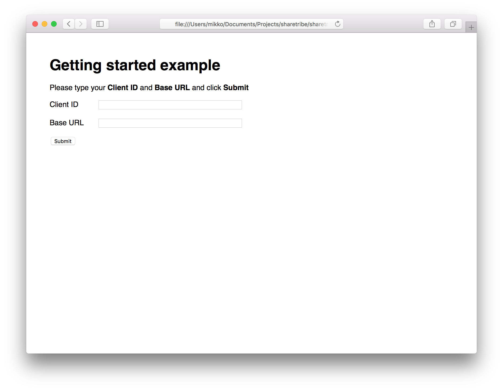
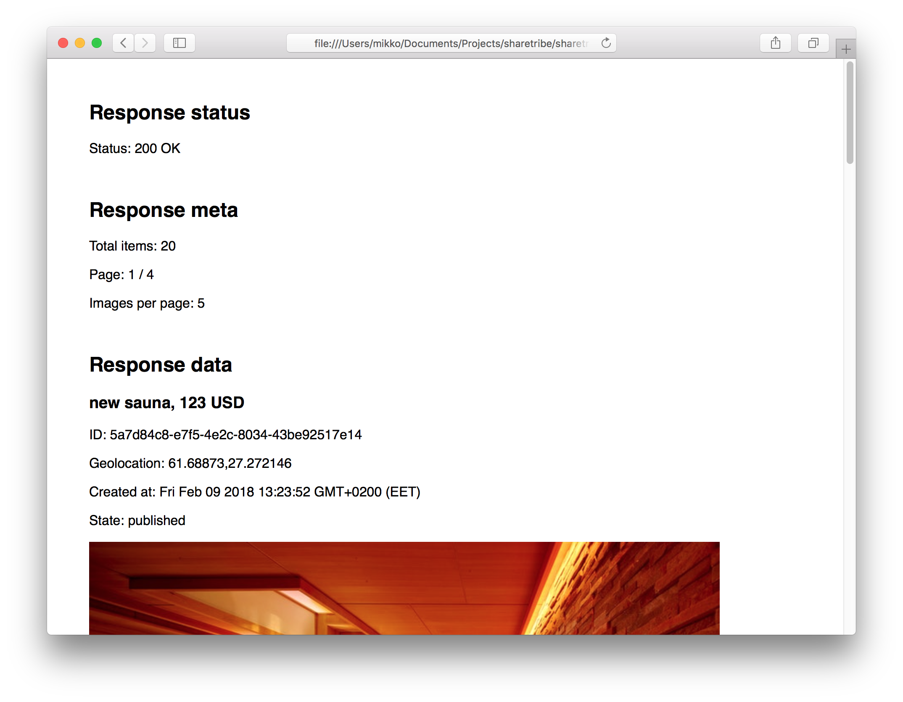

# Getting started example (browser)

This example shows how to query listings using the SDK, in browser.

## Requirements

* Client ID and Base URL

## How to run the example:

```
$ cd [project-root]
$ yarn install
$ yarn run build
$ cd examples/getting-started-browser
$ open index.html
```

## Screenshots



