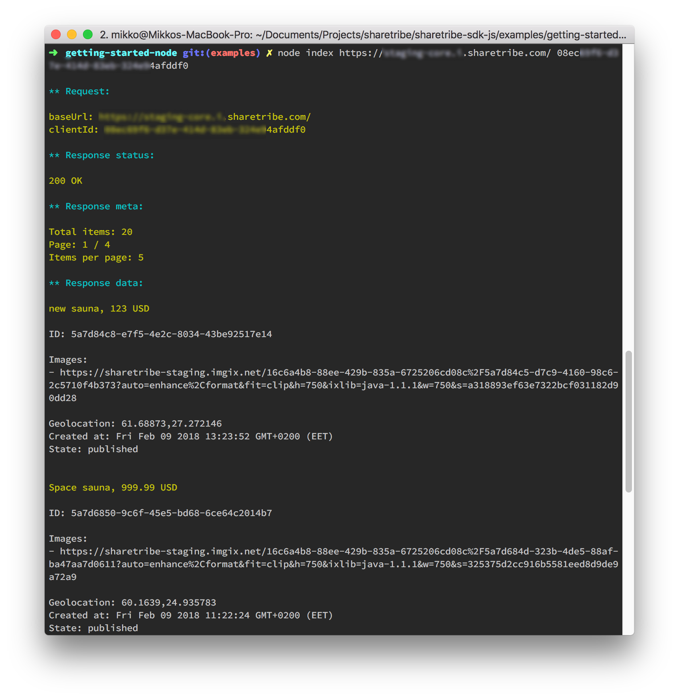

# Getting started example (Node.js)

This example shows how to query listings using the SDK, in Node.js environment.

## Requirements

* Node.js
* Yarn
* Client ID

## How to run the example:

```
$ cd [project-root]
$ yarn install
$ yarn run build
$ cd examples/getting-started-node
$ node index.js [clientId]
```

## Screenshots


